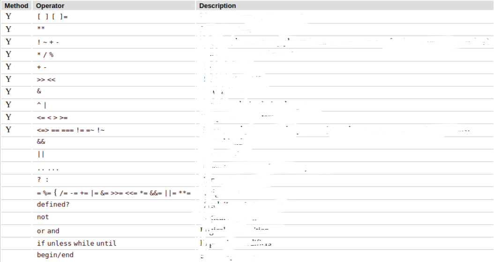

# Course description:

Curso Ruby e Ruby on Rails codeminers42 do Fábio Makima. Questões criadas com base nos slides do curso CodeMiners42

## Pelos números

#### Nível de experiência: Todos os níveis

#### Idiomas: Português

#### Aulas: Jun/Ago 2023

#### Presencial: Todos os sábados.

# AULA 4

- Slide 21 tem 2 erros: 1 é "he77o"gsub falta o ponto e o .delete deleta todas as ocorrencias do valor entao a saida deveria ser "Heo Word"
  tem erro no slide 41: o spaceship retorna -1 se o valor da esquerda for menor, 0 iguais e 1 se o valor da esquerda é maior (ou o valor da direita menor)
  erro no slide 46: valor zero é false no ruby
  erro no slide 48: sintaxe do case when é when when when para cada caso, não case.

1. Quais são os padrões do Rails para:

a) nomes de variáveis

b) constantes

c) métodos

d) interrogação em métodos

e) exclamação em métodos

f) Syntactics sugar operadores aritmeticos

g) operações inteiro/inteiro float/inteiro float/float

h) Conversão de tipos (CAST)

i) conversão de float para inteiro

j) par ou impar

k) methods

l) string literals

m) escape characters

n) barra inversa, backspace, quebra de linha espaço, tabulação, aspas simples e duplas

o) interpolação

p) performance aspas duplas x aspas simples

q) 3 formas de concatenação

r) substrings

1. index

2. intervalo

3. do final pro inicio

4. intervalo array dois pontos

5. com tres pontos

6. botar inicial maiuscula

7. verificar se a string contem uma substring

8. colocar tudo maiuscula

9. minuscula

10. está vazio

11. comprimento

12. substituir a primeira ocorrencia

13. substituir todas

14. inserir no final

15. apagar primeira ocorrencia

16. inserir no inicio

17. converter para string

s) Simbolos

t) exponenciacao

u) Simbolos x String

v) sobre strings e simbolos

1. "string".object_id == "string".object_id

2. :symbol.object_id == :symbol.object_id

3. "string" == "string"

w) Booleans

x) nil

y) quais são os 8 operadores de assignment?

2. O que são variáveis?

3. Como declarar variaveis no rails

a) quanto a nomes

b) tipo de case na escrita

c) atribuições multiplas

d) desestruturação

e) trocar dois valores usando desestruturação

4. Como declarar expressões condicionais

a) normal

b) em uma linha

c) condicional ternário

d) se não e se não se

e) operadores logicos

f) outras 2 formas de comparação

g) diferença entre avaliar so o valor e avaliar o valor e o tipo e se sao exatamente o mesmo objeto.

5. Explique o que é o Spaceship operator

6. Dê o resultado para cada caso de spaceship operator:

a) 5<=> 10

b) 10 <=> 10

c) 10 <=> 5

7. cite os 6 operadores logicos

8. Qual a ordem de precedência dos operadores?

9. nomeie os operadores da tabela a seguir com as suas funções
   

10. Qual o comportamento do ruby quanto aos thruthy e falsy?

11. Explique e diga como é a sintaxe para:

a) case whem

b) if pós fixado

c) unless

d) operador ternário

12. o que são loops no rails?

13. Explique e diga como é a sintaxe para:

a) loop

b) while

c) until

d) times

e) upto e downto

14. O que são ranges em ruby?

15. explique e diga como é a sintaxe para:

a) range inclusivo

b) range exclusivo

c) para letras

d) casos com range

16. O que são arrays em ruby?

17. explique e diga como é a sintaxe para:

a) declarar um array atribuição

b) declarar um array por metodo

c)%w e %i

d) acessar index do array inicio

e) acessar ordem array a partir do fim

f) acessar primeiros x

g) acessar ultimos y

h) adicionar valor no array 2 formas

i) remover valor array

j) shift e unshift

k) concatenar com operador

l) concatenar com metodo

m) remover todas as entradas de um tipo

n) mostrar os metodos de array

o) inverter o array

p) verificar se o valor está contido

q) unir os espaços do array em uma unica string

r) criar um array com x entradas repetidas

s) criar um array com esse valor repetido x vezes

u) criar um array com x espaços vazios.

v) unir os espaços do array em uma unica string separando por outra string

18. Diga qual o resultado para os seguintes metodos:

a) [].empty

b) [[]].empty?

c) [1,2].empty?

d) [1,2,3].lenght

e) [1,2,3].reverse

f) [1,2,3].include(3)

g) [1,2,3].include("3")

h) [1,2,3].join

i) [1,2,3].join( "-" )

19. Responda o que é um hash e quais as diferenças para um array.

20. responda sobre hashs:

a) como declarar um hash

b) como exibir todas as suas chaves

c) receber o valor de uma chave

d) qual valor perguntar por uma chave que nao existe é exibido?

e) como usar simbolos como chaves e qual a diferença

f) verificar a existencia de uma chave

g) verificar a existencia de um valor

h) juntar dois hashes

21. O que são métodos em Ruby?

22. Responda sobre metodos:

a) como criar um método

b) Diga quais são válidos na nomeação de um metodo

    1) method_name

    2) _name_of_method

    3) 1_method_name

    4) method_27

    5) method?_name

    6) method_name!

    7) begin

    8) begin_count

c) Como declarar multiplos parâmetros

d) Encadear pelo menos 4 métodos

e) metodos predicados

f) métodos bang

g) definir um valor padrao para parametros

23. Responda sobre os enumeráveis

a) O que são enumeráveis?

b) como utilizar o método select

c) método each

d) each com hash separando chave e valor

e) utilizando o par

f) each with index

g) map

h) reduce

i) include

j) any

k) all

l) none

24. Crie um array com 5 nomes. A partir disso crie um método onde seja possível selecionar de que forma iremos retornar um vetor com todos os nomes menos o que o usuário não desejar e imprimir na tela. As formas são as seguintes:

- por loop
- select
- each linha unica
- each do
- com hash chave valor
- com o par do hash
- each with index
- Map
- pluck
- reduce

## DESAFIO

Escreva um método que implemente o algoritmo da cifra de césar:
Caso a letra ultrapasse do “z” retorne a contagem para o “a”
Mantenha letra maiúsculas e minúsculas

## DESAFIO EXTRA

https://shorturl.at/tMPWZ

# AULA 5 07/01/2023

1. O que é o GIT

2. Quais os objetivos do GIT

3. Como iniciar um repositório no git

4. quais os estados que o git pode manter os arquivos?

5. Qual o fluxo normal de trabahlo no git

6. Qual a forma de ignorar arquivos no git e quais as vantagens e conveniencias disso

7. Quais os 2 comandos para visualizar os estados os objetos no git

8. O que são branches no git e qual ocomando para iniciar um branch no git

9. O que é o merge e qual a sua utilidade. A comando deve ser dado de qual branch?

10. Como adicionar um repositório remoto em um repositório?

11. Quais são os comandos para interagir com o repositório remoto?

12. O que é o pull request?

## POO

1. O que significa POO e no que consiste.

2. Quais são os 04 principios da POO

3. Descreva:
   a) classes

b) objetos

c) quais tipos de blocos de codigo podemos ter em uma classe ruby

4. Explique sobre a sintaxe ruby:

a) o papel do @

b) métodos públicos e privados

c) Encapsulamento

d) Herança

e) Modulos

f) Polimorfismo

g) Open Class

h) Self

i) Operações

j) Macros

k) Singleton Methods

l) class definitions

m) define_method

## DESAFIO

Crie o jogo da senha usando POO.

- Toda vez que o jogo iniciar o computador irá escolher 4 cores para formar a sequência da senha.
- Você como jogador terá 10 chances para descobrir qual é a senha correta.
- Quando você inserir uma tentativa de senha o computador deve retornar quantas cores estão certas e no lugar certo e quantas cores estão certas e no local errado, sem indicar qual cor são essas.
- Ao final de 10 rodadas você não conseguir acertar a sequência o computador ganha
- Se acertar a sequência a qualquer momento, você ganha
- Use os conceitos de POO para gerenciar as interações entre os objetos.
- Extra: Deixe o código genérico podendo receber quantidades de rodadas, quantidade de cores da sequência e as cores dos pins.

# AULA 6 07/08/2023

1. O que são testes automatizados?

2. Quais garantias os testes automatizados proporcionam?

3. O que é o RSPEC

4. Exemplifique a estrutura padrão de um teste?

5. Explique o subject e let do RSPEC e suas peculiaridades.

6. Explique blocos de teste e como podem ser definidos.

7. Quais são os 02 tipos de testes automatizados e qual a descrição de cada um.

8. Explique quantas foram apresentadas e quais são as boas práticas na construção de testes no rails.

9. Escreva testes para os dois trabalhos anteriormente.

# AULA 7 07/15/2023

1. Explique o que é o Ruby on Rails.

2. Quais são os componentes do modelo MVC, descreva o papel de cada um no RoR.

3. Qual a filosofia do RoR quanto à organização de código dos models e controllers?

4. Cite quais os elementos e explique o fluxo de acesso do usuário em um aplicação RoR.

5. Explique o que é o Convention over Configuration e no que consiste ao que concerne a convenção de nomenclatura.

6. Como fazer para criar models em um arquivo vazio?

7. Escreva a sintaxe dos seguintes operações do CRUD:

   a) Criar um novo registro usando o metodo create;

   b) = usando o método new;

   c) retornar todos os valores de uma coleção;

   d) retornar o primeiro, último ou valor da coleção em qualquer posição;

   e) retornar buscando por um valor específico;

   f) encontrar todos os resultados com um valor específico e ordenando por um campo específico em ordem decrescente;

   g) buscar, modificar salvar o objeto no banco;

   h) usando o método específico para mudanças;

   i) buscar e destruir um objeto;

   j) encontrar e deletar todas as entradas com um campo com valor específico;

   k) deletar todos os objetos de uma coleção;

   l) salvar fazendo validações com e sem retorno de erro.

8. O que são migrations?

9. O que são associações? Como fazer para estabelecer reuniões de tabelas e fazer com que ao deletar uma, todos sejam deletados.

10. Qual a sintaxe para criação de um objeto já com um relacionamento estabelecido?

11. Quais são os tipos de associações do RoR?

# DESAFIO

## Introdução ao Rails - Peeper

Uma famosa plataforma de microblogging tem passado por maus bocados depois de uma recente aquisição. Os mais pessimistas preveêm que ela não sobreviverá por muito tempo e o seu cliente, contanto com isso, contratou você para desenvolver a nova plataforma que irá tomar o seu lugar: o Peeper.

## Modelos

### User

##### Campos

- handle: O nome que os usuários usam para referenciar uns aos outros dentro da plataforma. É obrigatório, deve conter entre 4 e 12 caracteres, não pode se repetir e não pode conter espaços, acentos ou caracteres especiais, apenas letras, números e underscore (\_).
- display_name: O nome de exibição do usuário. É obrigatório, deve conter no máximo 30 caracteres e pode conter qualquer caractere.
- bio: Texto livre de até 300 caracteres. É opcional.
- born_at: Data de nascimento do usuário. É obrigatório. O usuário precisa ter pelo menos 13 (anos) para criar a conta.

## Associações

- um usuário pode ter vários status.
- um usuário pode seguir outros usuários.

## Requisitos extra

- O usuário deve ser capaz de fazer upload de uma imagem para representar a sua conta.

## Status

#####Campos

- body: é o corpo da postagem. Texto livre de até 300 caracteres (mais que a concorrência!), obrigatório.

### Associações

- um status pertence a um usuário.
- um status pode ser em resposta a outro status.
- um status pode ter entre 0 e 4 mídias.

## Media

#####Campos

- type: Define se a mídia é uma imagem ou um vídeo. É um campo inteiro, obrigatório.
- url: a URL que aponta para a mídia em questão.

### Associações

uma mídia pertence a um status.

## Requisitos extra

- O usuários deve ser capaz de fazer upload da imagem ou vídeo da mídia.

## Requisitos

- Podem usar o SQLite como banco de dados.
- Não usem scaffold.
- Não há necessidade de criar views nesse momento.
- Todos os models devem possuir testes unitários usando RSpec.
- Façam commits organizados.

# AULA 8 07/22/2023

1. O que é o Rails Router e qual o seu papel no framework?

2. O que é o Controller e qual o seu papel?

3. Quais as convenções de nome do controller?

4. Como criar um controller em um documento em branco?

5. Explique qual o fluxo de uso de um controller em uma aplicação rails.

6. Explique quais são os três tipos possíveis de parâmetros em uma aplicação RoR.

7. O que são Strong Parameters? Como eles são definidos em uma aplicação rails?

8. O que é o render e quais as opções de render? Explique cada uma delas.

9. Qual a função do helper redirect_to?

10. O que faz o helper head?

11. Em que consiste o HTML e ERB? Qual a sua notação?

12. Como acessar uma variável do controller a partir da view?

13. Qual a diferença de papeis entre o Action Controller e a ActionView?

14. Qual o papel do url helper e como utilizá-lo? Qual a sintaxe dos 3 tipos?

15. Explique:

a) form_for

b) fields_for

16. O que é um asset pipeline? Qual a sua utilidade?

## DESAFIO

Desenvolvimento web com Rails - Peeper
Já tendo a aplicação Rails com os modelos bem estruturados da nossa plataforma de microblogging Peeper, agora é necessário criar as views e controllers para ser possível finalmente visualizar a plataforma!

## Timeline

O mais importante para o microblog agora é ter um feed, onde seja possível visualizar todos os status que já foram postados e também adiconar novos status. Assim, a plataforma se tornará funcional.

### Views

#### Index (localhost:3000/status)

- Esta página é o feed, ou seja, uma lista de todos os status.
- No topo da página é necessário ter um botão para adicionar um status novo. Este botão rediretiona para a página `new`.
- Os dados do status que serão mostrados no feed são: `display_name` do user autor do status e o `body` do status (mas apenas os primeiros 50 caracteres).
- Para cada status existem ter 3 ações: responder, visualizar e deletar.
- Ao responder um status, redirecionar para a página `new`. Importante lembrar que é necessário ter a informação de qual status está sendo respodido para a criação do novo status, eles terão que estar associados.
- Ao visualizar um status, redirecionar para a página `show`.
- Ao cliar o botão para deletar um status, este status será apagado do banco de dados.

#### New (localhost:3000/status/new)

- Nesta página é necessário um formulário com os seguintes campos:
  - Campo select para selecionar o user que é o autor deste status.
  - Campo text para escrever o `body`.
  - Campo para adicionar uma mídia.
  - Botão "save" para salvar o novo status.

#### Show (localhost:3000/status/1)

- Esta é a página de detalhes do status.
- É necessário visualizar todos os campos do status (inclusive as mídias).
- Por fim, dois botões ao final da página: "back" (que volta para a página `index`) e "edit" (que redireciona para a página de editar o status).

#### Edit (localhost:3000/status/1/edit)

- Esta é a página de edição.
- Ela é igual a página de criação de um novo status, mas com o formulário já preenchido. Dica: é possível utilizar uma view compartilhada (partial).
- Ao final da página, o botão "save" para salvar as edições que foram feitas.

### Controller

- Criar a StatusController.
- Criar todos os métodos necessários para as actions que foram citadas acima.

### Rotas

- No arquivo `routes.rb` criar as rotas necessárias **sem o uso de resources**.

## Requisitos

- Como citado acima, não usar resources quando forem criar as rotas.
- Criar testes de requisição.
- Façam commits organizados.
